 

  

 

 

 

 

> [!IMPORTANT]
> 

> 
<b>S-RANK MISSION // WANTED</b>

> <h3><a href="https://github.com/anuragY77/CineVerse">CineVerse</a> — bounty: ¥∞</h3>
> 
<b>Premium movie/anime discovery platform with 3D effects, glassmorphism, real-time watch parties, and AI recommendations.</b>

> 
<code>JavaScript</code> <code>React</code> <code>Three.js</code> <code>AI</code>

> 

> [!TIP]
> 

> 
<b>A-RANK MISSION // GRIMOIRE ENTRY</b>

> <h3><a href="https://github.com/anuragY77/medcore-enterprise-hms">medcore-enterprise-hms</a></h3>
> 
<b>Premium enterprise Hospital Management System with RBAC, Drizzle ORM, and a modern clinical dashboard.</b>

> 
<code>TypeScript</code> <code>Next.js</code> <code>PostgreSQL</code> <code>Drizzle ORM</code>

> 

> [!NOTE]
> 

> 
<b>B-RANK MISSION // NEXT ISLAND</b>

> <h3><a href="https://github.com/anuragY77/portfolio">portfolio</a></h3>
> 
<b>Personal portfolio site built with Next.js — dark, fast, fully animated.</b>

> 
<code>TypeScript</code> <code>Next.js</code> <code>Tailwind CSS</code>

> 

 

 

 

  

  

<table border="0">
  <tr>
    <td>
      
    </td>
    <td>
      
    </td>
  </tr>
</table>

 

 

 

 

 

<!-- START_SECTION:activity -->
次回予告 — awaiting first sync — GitHub Actions will populate recent activity here.
<!-- END_SECTION:activity -->

 

 

<!-- START_SECTION:content -->
つづく — awaiting first sync — GitHub Actions will populate latest posts here.
<!-- END_SECTION:content -->

 

 

NEXT EPISODE: <a href="https://github.com/anuragY77">@anuragY77</a> :: season 2026 · stay tuned つづく

