

 

  


 


 


 

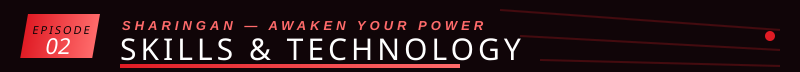

 


 

 

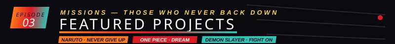

 

<a href="https://github.com/anuragY77">
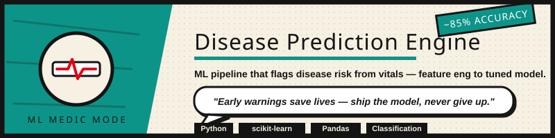
</a>

  

<a href="https://github.com/anuragY77">
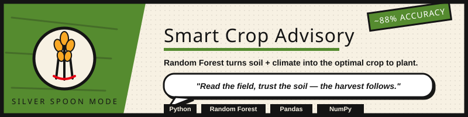
</a>

  

<a href="https://github.com/anuragY77/medcore-enterprise-hms">
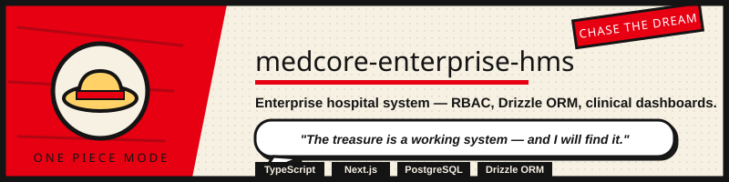
</a>

  

<a href="https://github.com/anuragY77/CineVerse">
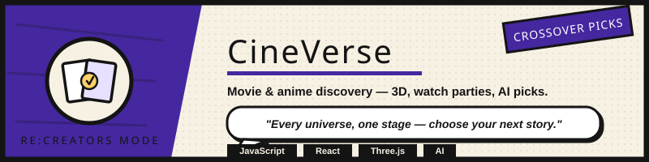
</a>

  

<a href="https://github.com/anuragY77">
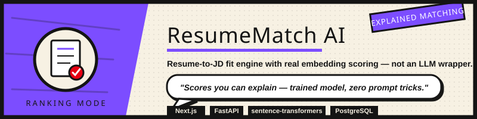
</a>

  

<a href="https://github.com/anuragY77">
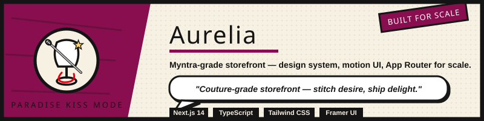
</a>

 

 


 

  

  

<table border="0">
  <tr>
    <td>
      
    </td>
    <td>
      
    </td>
  </tr>
</table>

 

 

 

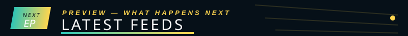

 


 

<!-- START_SECTION:activity -->
Next episode loading — awaiting first sync — GitHub Actions will populate recent activity here.
<!-- END_SECTION:activity -->

 

 

<!-- START_SECTION:content -->
Stay tuned — awaiting first sync — GitHub Actions will populate latest posts here.
<!-- END_SECTION:content -->

 


 

NEXT EPISODE: <a href="https://github.com/anuragY77">@anuragY77</a> · Season 2026 · Stay tuned

