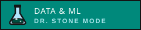
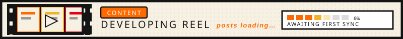

 

  

 

 

 

 

 

 

<table>
<tr>
<td valign="top" width="33%">

  

</td>
<td valign="top" width="33%">

  

</td>
<td valign="top" width="33%">

  

</td>
</tr>
</table>

 

 

 

  

  

  

  

  

 

 

 

  

  

 

 

 

 

<!-- START_SECTION:activity -->
Signal standby — first activity transmission pending — GitHub Actions will fill this channel.
<!-- END_SECTION:activity -->

 

 

<!-- START_SECTION:content -->
Reel in the darkroom — first content drop pending — GitHub Actions will develop this strip.
<!-- END_SECTION:content -->

 

 

NEXT EPISODE: <a href="https://github.com/anuragY77">@anuragY77</a> · Season 2026 · Stay tuned

